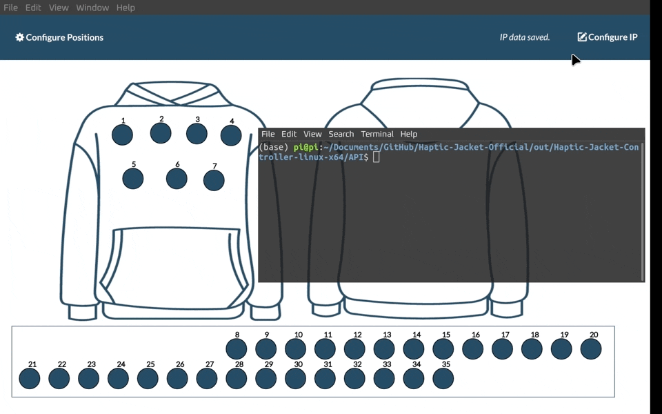

# Haptic Jacket Middleware Official Repository

To download the built binaries, go to the [releases page](https://github.com/Pi-31415/Haptic-Jacket-Official/releases/tag/release).

.


This is the official repository for the haptic jacket middleware for my research project.

Documentation [on Gitbook](https://pi31415.gitbook.io/haptic-jacket/)



### Related Repositories

- [Flutter-UDP-Client-Android](https://github.com/Pi-31415/Flutter-UDP-Client-Android)

## Requirements

- **NodeJS**
- **Electron**

## Electron - related documentation

**Clone and run for a quick way to see Electron in action.**

This is a minimal Electron application based on the [Quick Start Guide](https://electronjs.org/docs/tutorial/quick-start) within the Electron documentation.

**Use this app along with the [Electron API Demos](https://electronjs.org/#get-started) app for API code examples to help you get started.**

A basic Electron application needs just these files:

- `package.json` - Points to the app's main file and lists its details and dependencies.
- `main.js` - Starts the app and creates a browser window to render HTML. This is the app's **main process**.
- `index.html` - A web page to render. This is the app's **renderer process**.

You can learn more about each of these components within the [Quick Start Guide](https://electronjs.org/docs/tutorial/quick-start).

## Development Commands

Make sure that the node you have is >= 10.0

```bash
# Install dependencies
npm install
npm i --save-dev electron
# Run the app
npm start
```

# Building Commands

## Windows Build

First get electron installer

```
npm install -g electron-builder
```

Then set up policy (change username)

```
powershell -ExecutionPolicy Bypass -File C:\Users\97156\AppData\Roaming\npm\electron-builder.ps1
```

Then build with

```
electron-builder --win
```

## MacOS Build

First get

```
npm i -g electron-packager
```

Just run macbuild.sh

## Ubuntu Build

**First install electron and installer by running**

```
npm i --save-dev electron
npm install --save-dev electron-installer-snap
npm i -g electron-packager
```

Then run ./ubuntubuild.sh

Output is in out/Haptic-Jacket-Controller-linux-x64.tar.gz

Ubuntu build uses [electron-installer-snap](https://github.com/electron-userland/electron-installer-snap)

## Editing Style

To compile scss, run

```
sass --watch www/styles/flat-ui-pro.scss:www/css/flat-ui-pro.css
```

Install sass if not available by running

```
sudo npm install -g sass
```

## Running Middleware

For Programmers, the Haptic Jacket GUI app can be invoked through a python API. Run the file in extraResources/API folder.
